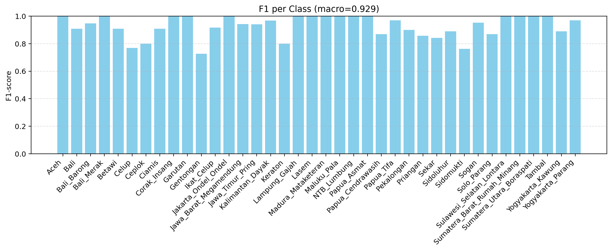
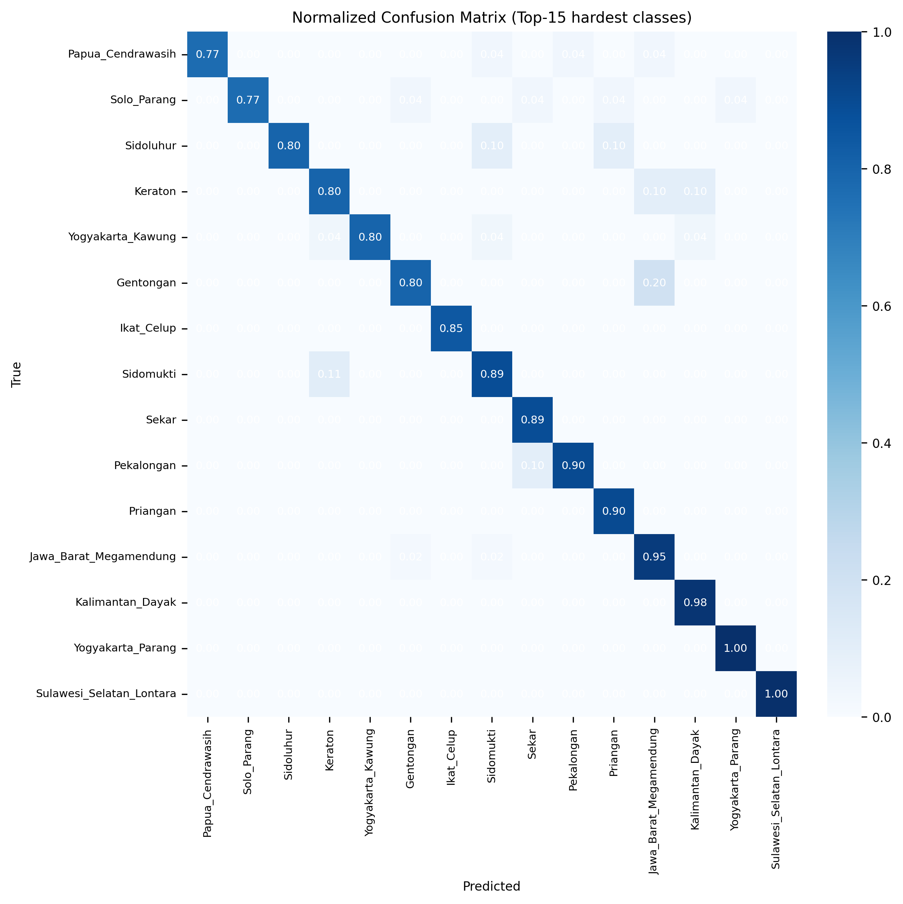

# Indonesian Batik Classification

A deep learning project for Indonesian batik pattern classification using three different architectures: **CNN**, **Vision Transformer (ViT)**, and **Hybrid CNN-ViT**. The models use ArcFace loss to generate more discriminative embeddings.

## 📋 Table of Contents

- [Key Features](#key-features)
- [Model Architectures](#model-architectures)
- [Requirements](#requirements)
- [Dataset Structure](#dataset-structure)
- [Installation](#installation)
- [Usage](#usage)
  - [Training Models](#training-models)
  - [Visualizing Results](#visualizing-results)
  - [Confusion Matrix Analysis](#confusion-matrix-analysis)
- [Project Structure](#project-structure)
- [Outputs and Results](#outputs-and-results)
- [Configuration](#configuration)

## 🎯 Key Features

- **3 Model Architectures:**

  - **CNN**: EfficientNet-B2 with Channel & Spatial Attention
  - **ViT**: Vision Transformer (ViT-B/16 or ViT-B/32)
  - **Hybrid**: Combination of ResNet50 + ViT with Gated Fusion

- **ArcFace Loss**: Metric learning for more discriminative embeddings
- **Comprehensive Evaluation**: Accuracy, F1-score, Confusion Matrix, Classification Report
- **Visualization**: Model comparison plots, confusion matrix, F1 per class
- **Reproducible**: Seed fixing for consistent results

## 🏗️ Model Architectures

### 1. CNN Model

- Backbone: EfficientNet-B2 (pretrained on ImageNet)
- Channel Attention & Spatial Attention modules
- Embedding dimension: 512
- ArcFace margin: s=30.0, m=0.50

### 2. ViT Model

- Backbone: ViT-B/16 (pretrained on ImageNet)
- Transformer encoder with positional embedding
- Dynamic position embedding interpolation
- Embedding dimension: 512

### 3. Hybrid Model

- CNN Branch: ResNet50 (spatial features)
- ViT Branch: ViT-B/16 (global features)
- Gated Fusion to combine both branches
- Embedding dimension: 512

## 📦 Requirements

### Main Dependencies:

```
torch >= 2.0.0
torchvision >= 0.15.0
numpy
matplotlib
seaborn
scikit-learn
Pillow
tqdm
```

### Installing Dependencies:

```bash
pip install torch torchvision numpy matplotlib seaborn scikit-learn Pillow tqdm
```

## 📁 Dataset Structure

The dataset must be structured as follows:

```
dataset_batik/
├── train/
│   ├── class1/
│   │   ├── image1.jpg
│   │   ├── image2.jpg
│   │   └── ...
│   ├── class2/
│   │   ├── image1.jpg
│   │   └── ...
│   └── ...
└── test/
    ├── class1/
    │   ├── image1.jpg
    │   └── ...
    ├── class2/
    │   └── ...
    └── ...
```

**Note:** Folder names in `train/` and `test/` must match and represent batik class names.

## 🚀 Installation

1. **Clone or download this repository:**

```bash
git clone <repository-url>
cd indonesianbatik-classification
```

2. **Install dependencies:**

```bash
pip install torch torchvision numpy matplotlib seaborn scikit-learn Pillow tqdm
```

3. **Prepare your dataset:**
   - Place dataset in `dataset_batik/` folder (in parent directory of Code_Batik)
   - Or adjust the path in `train.py` variable `DATA_DIR`

## 💻 Usage

### Training Models

#### 1. Select Model in `train.py`

Edit this line in [train.py](train.py#L23):

```python
MODEL = "cnn"  # Choose: "cnn", "vit", or "hybrid"
```

#### 2. Adjust Configuration (Optional)

Edit parameters in `PRESET` dictionary in [train.py](train.py#L25-L29):

```python
PRESET = {
    "cnn":    {"IMG_SIZE": 224, "BATCH_SIZE": 32, "EPOCHS": 100, "LR": 1e-4, "NUM_WORKERS": 8},
    "vit":    {"IMG_SIZE": 224, "BATCH_SIZE": 32, "EPOCHS": 100, "LR": 1e-4, "NUM_WORKERS": 8},
    "hybrid": {"IMG_SIZE": 224, "BATCH_SIZE": 32, "EPOCHS": 100, "LR": 1e-4, "NUM_WORKERS": 8},
}
```

Adjustable parameters:

- `IMG_SIZE`: Input image size (default: 224)
- `BATCH_SIZE`: Number of images per batch (default: 32)
- `EPOCHS`: Number of training epochs (default: 100)
- `LR`: Learning rate (default: 1e-4)
- `NUM_WORKERS`: Number of workers for data loading (default: 8)

#### 3. Adjust Dataset Path

Edit `DATA_DIR` variable in [train.py](train.py#L33):

```python
"DATA_DIR": str(BASE / "dataset_batik"),  # Adjust to your dataset location
```

#### 4. Run Training

```bash
python -m train
```

**Training Outputs:**

- Model checkpoint: `checkpoints/{model_name}/last.pt`
- Metrics JSON: `results/{model_name}/metrics_test.json`
- Metrics CSV: `results/{model_name}/metrics_test.csv`
- Confusion Matrix: `results/{model_name}/confusion_matrix_test.png`
- F1 per Class: `results/{model_name}/f1_per_class_test.png`

### Visualizing Results

After training multiple models, you can compare their performance:

#### 1. Edit Models to Compare

Edit in [viz.py](viz.py#L6):

```python
MODELS = ["cnn", "vit", "hybrid"]  # Choose trained models
```

#### 2. Run Visualization

```bash
python -m viz
```

**Outputs:**

- `comparison/accuracy_comparison.png` - Accuracy bar chart
- `comparison/f1macro_comparison.png` - F1-macro bar chart
- `comparison/f1_per_class_comparison.png` - Grouped bar chart for F1 per class
- `comparison/summary.csv` - Summary comparison table

### Confusion Matrix Analysis

For in-depth analysis of hard-to-classify classes:

#### Run with Defaults (Top-15 hardest classes):

```bash
python -m cf
```

#### Custom Parameters:

```bash
# Top-20 classes with highest error
python -m cf --topk 20 --mode error

# Top-15 classes with lowest F1-score
python -m cf --topk 15 --mode lowf1

# Specify custom model and output
python -m cf --json results/cnn/metrics_test.json --out results/cnn/confmat_top15.png --topk 15
```

**Parameters:**

- `--json`: Path to metrics_test.json file (default: results/hybrid/metrics_test.json)
- `--out`: Output path for confusion matrix image (default: results/hybrid/confmat_top15.png)
- `--topk`: Number of classes to display (default: 15)
- `--mode`: Class selection mode - `error` (classification error) or `lowf1` (low F1-score)

## 📂 Project Structure

```
indonesianbatik-classification/
├── __init__.py
├── train.py                    # Main training script
├── viz.py                      # Visualization comparison script
├── cf.py                       # Confusion matrix analysis script
├── try.py                      # Experiment script (optional)
├── data/
│   ├── __init__.py
│   └── dataload.py            # DataLoader and preprocessing
├── model/
│   ├── __init__.py
│   ├── cnn.py                 # CNN model with attention
│   ├── vit.py                 # Vision Transformer model
│   └── hybrid.py              # Hybrid CNN-ViT model
├── utils/
│   ├── __init__.py
│   ├── seed.py                # Seed fixing for reproducibility
│   └── utils.py               # Utility functions
├── checkpoints/               # Model weights (auto-generated)
│   ├── cnn/
│   ├── vit/
│   └── hybrid/
├── results/                   # Evaluation results (auto-generated)
│   ├── cnn/
│   ├── vit/
│   └── hybrid/
├── comparison/                # Comparison visualizations (auto-generated)
└── logs/                      # Log files (auto-generated)
```

## 📊 Outputs and Results

### 1. Model Checkpoint

File: `checkpoints/{model_name}/last.pt`

Contains:

- `model`: PyTorch model state dict
- `epoch`: Last epoch number
- `classes`: List of class names

### 2. Metrics JSON

File: `results/{model_name}/metrics_test.json`

Structure:

```json
{
  "classes": ["class1", "class2", ...],
  "test": {
    "accuracy": 0.95,
    "f1_macro": 0.94,
    "classification_report": {...},
    "confusion_matrix": [[...]]
  }
}
```

### 3. Metrics CSV

File: `results/{model_name}/metrics_test.csv`

Format:

```csv
label,precision,recall,f1,support
class1,0.950000,0.960000,0.955000,100
class2,0.940000,0.930000,0.935000,95
...
macro avg,0.945000,0.945000,0.945000,1500
weighted avg,0.946000,0.946000,0.946000,1500
accuracy,0.946000,,,
```

### 4. Visualizations

#### F1-Score per Class



- Bar chart of F1-score for each class
- Shows macro average F1 line

#### Model Comparison


#### Top-K Hardest Classes



- Focus on 15 hardest classes
- Helps analyze error patterns

## ⚙️ Configuration

### Important Hyperparameters

1. **ArcFace Parameters** (in `train.py`):

```python
"EMBED_DIM": 512,    # Embedding dimension
"ARC_S": 30.0,       # Scale parameter
"ARC_M": 0.50,       # Margin parameter
```

2. **Training Parameters**:

```python
"BATCH_SIZE": 32,    # Batch size
"EPOCHS": 100,       # Number of epochs
"LR": 1e-4,          # Initial learning rate
"IMG_SIZE": 224,     # Input image size
```

3. **Data Augmentation** (in `data/dataload.py`):

```python
transforms.Compose([
    transforms.Resize((img_size, img_size)),
    transforms.ToTensor(),
    transforms.Normalize(mean=(0.485,0.456,0.406), std=(0.229,0.224,0.225)),
])
```

### Hardware Recommendations

- **Minimum**:

  - GPU: 6GB VRAM (GTX 1660 Ti or equivalent)
  - RAM: 8GB
  - Storage: 10GB (dataset + checkpoints)

- **Recommended**:
  - GPU: 8GB+ VRAM (RTX 2070 or higher)
  - RAM: 16GB+
  - Storage: 20GB+

### Training Tips

1. **If Out of Memory**:

   - Reduce `BATCH_SIZE` (e.g., 16 or 8)
   - Reduce `NUM_WORKERS` (e.g., 4 or 2)

2. **If Training is Slow**:

   - Ensure using GPU (CUDA)
   - Increase `NUM_WORKERS` if CPU is powerful
   - Use `pin_memory=True` (already default)

3. **If Underfitting**:

   - Increase `EPOCHS`
   - Increase `LR` (careful with instability)
   - Use more complex model (hybrid)

4. **If Overfitting**:
   - Add data augmentation
   - Increase dropout rate in model
   - Reduce `EPOCHS`

## 📝 Complete Workflow Example

```bash
# 1. Train CNN model
# Edit train.py: MODEL = "cnn"
python -m train

# 2. Train ViT model
# Edit train.py: MODEL = "vit"
python -m train

# 3. Train Hybrid model
# Edit train.py: MODEL = "hybrid"
python -m train

# 4. Compare all models
python -m viz

# 5. Analyze confusion matrix for best model
python -m cf --json results/hybrid/metrics_test.json --out results/hybrid/confmat_top15.png
```

## 🤝 Contributing

Feel free to create issues or pull requests for:

- Bug fixes
- Feature requests
- Improvement suggestions
- Documentation updates

## 📄 License

This project is for research and educational purposes.

## 📧 Contact

For questions or further discussion, please create an issue in this repository.

---

**Happy Coding! 🎨🇮🇩**
